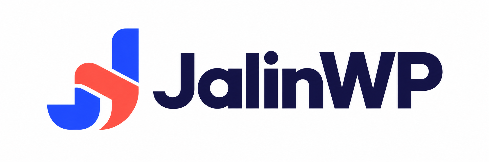

# JalinWP



**An open-source MCP gateway for WordPress and WooCommerce.** Connect an AI client to your site using OAuth, retrieve permitted information, and choose how changes are applied.

This repository contains **JalinWP 0.3.3**, its complete plugin source, local test harnesses, documentation, and release tooling. It is ready to initialize as a Git repository; no GitHub account or repository URL is embedded in the project.

## What It Does

| Area | Capabilities |
| --- | --- |
| WordPress | Read and manage posts, pages, categories, tags, existing media metadata, and comments within the account's permissions. |
| WooCommerce | Manage products, variations and coupons; retrieve orders and customers; create unpaid manual orders and update supported order fields. |
| Sales And Finance | Analyze sales, tax rates, payment methods, customer fees, shipping, discounts and recorded refunds. Map optional gateway fees, net amounts and affiliate data. |
| Page Design | Discover templates, use JalinWP Canvas without theme header/footer wrappers, and create structured Gutenberg content with supported core blocks. |
| Connections | Built-in OAuth registration and WordPress consent for ChatGPT and Claude; an optional local Application Password bridge. |
| Administration | Separate setup, OAuth connection history, access controls, finance setup, change review and activity screens. Revoke connections and clear inactive history. |

New setups use **Read Only**. Administrators can explicitly select **Reviewed Changes**, requiring WordPress approval before execution, or **YOLO Mode**, allowing supported changes without dashboard approval. Native WordPress permissions, current access controls and OAuth consent still apply in every mode. Upgrades preserve saved modes.

See the [plugin guide](fames-mcp-gateway/README.md) for supported operations and boundaries. This version does not collect payments, issue refunds, edit theme PHP, or provide arbitrary code/SQL execution. Structured design adapters cover a bounded set of core blocks; they are not a general visual-builder editor.

## Requirements

| Use | Requirements |
| --- | --- |
| WordPress Plugin | WordPress 6.6+, PHP 8.1+, HTTPS and working path-based REST routes. Activate and configure per site; network-wide activation is unsupported. |
| Commerce Features | An active WooCommerce installation and an account with the relevant WooCommerce permissions. |
| Package ZIPs | Python 3.9+. No PHP, Node.js or WordPress installation is needed just to package the checked-out source. |
| Local Integration Tests | Node.js 22+, npm and internet access for the initial pinned dependency/fixture downloads. |

The documented local integration environment is WordPress **6.8.8**, PHP **8.3** through Playground/SQLite, and WooCommerce **10.2.2** where loaded. That is an executed test environment, not verification of every supported version. See [Validation](fames-mcp-gateway/docs/VALIDATION.md) for exact results and pending native-database, browser and hosted-client checks.

## Build And Install

From the repository root:

```sh
python3 scripts/package.py
```

This creates:

- `dist/jalinwp-0.3.3.zip` — installable WordPress plugin.
- `dist/jalinwp-0.3.3-source.zip` — complete development source archive.

Upload the **installable** ZIP through **Plugins → Add New → Upload Plugin** on staging. The repository archive and GitHub's automatically generated source ZIP are development archives; use the installable ZIP for WordPress.

1. Activate JalinWP and open **Settings → JalinWP → Connection Setup**.
2. Click **Enable For My Account**. First-time setup remains Read Only.
3. Copy the displayed connector URL into your AI client's custom MCP connection and choose OAuth. Use automatic client registration where supported.
4. Sign in to WordPress and approve the requested access. Start with a permitted read.
5. Use **Access Controls** to enable financial data access or choose another change mode when needed. Additional OAuth permissions require fresh consent.

The connection URL retains `/wp-json/fames-mcp/v1/mcp`. Keep the installed directory and bootstrap at `fames-mcp-gateway/fames-mcp-gateway.php` to preserve upgrades from the original Fames MCP Gateway name.

See [Connection Setup](fames-mcp-gateway/docs/CONNECTING-CHATGPT.md), [Connection Recovery](fames-mcp-gateway/docs/CONNECTION-RECOVERY.md), and [0.3.3 Upgrade Notes](fames-mcp-gateway/docs/UPGRADE-0.3.3.md).

## Repository Guide

| Location | Purpose |
| --- | --- |
| `fames-mcp-gateway/` | Installable plugin source, bundled brand assets, plugin documentation and maintained test cases. |
| `test-runtime/` | Disposable WordPress/PHP-WASM runner, pinned npm lockfiles, integration wrappers and saved development evidence. |
| `scripts/` | Current repository packaging and verification tools. |
| `docs/REPOSITORY-SETUP.md` | Initialize this folder, publish it to GitHub, and attach the installable ZIP to a release. |
| `AGENTS.md` | Source map and working guidance for coding agents. |
| `CONTRIBUTING.md` | Local setup, focused verification and contribution workflow. |
| `SECURITY.md` | Vulnerability reporting and security maintenance guidance. |

The packaged validation reports describe prior plugin development runs. Creating this repository kit does not imply those integration suites were rerun. See [repository kit validation](docs/REPOSITORY-VALIDATION.md) for the checks performed while assembling this kit. Historical reports and handoffs are reference material; use current code and [current validation](fames-mcp-gateway/docs/VALIDATION.md) to assess behavior.

## Develop And Contribute

Begin with [Contributing](CONTRIBUTING.md) and the [Developer Tests Guide](test-runtime/DEVELOPER-TESTS.md). No access to a live WordPress site is required for the local fixture tests.

Useful implementation references:

- [Architecture](fames-mcp-gateway/docs/ARCHITECTURE.md)
- [OAuth Development](fames-mcp-gateway/docs/OAUTH-DEVELOPMENT.md)
- [Change Modes](fames-mcp-gateway/docs/YOLO-MODE.md)
- [Sales And Finance Definitions](fames-mcp-gateway/docs/ANALYTICS.md)
- [Page Design](fames-mcp-gateway/docs/PAGE-DESIGN.md)
- [Brand Guidelines](fames-mcp-gateway/docs/BRAND-GUIDELINES.md)

## License

JalinWP is licensed under **GPL-2.0-or-later**. See [LICENSE](LICENSE). Original implementation for Team Fames; no WPVibe code or assets are included. WordPress, WooCommerce and other third-party product names belong to their respective owners; use of those names does not imply endorsement.
